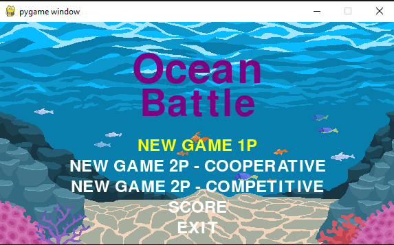
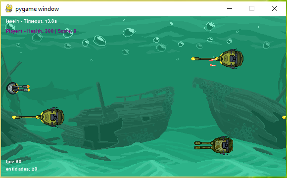
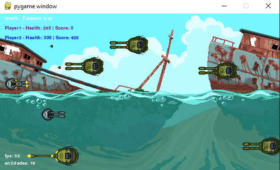

# 🎮 OCEAN BATTLE 🎮


## 📖 Sobre

Este projeto foi desenvolvido em Python como parte dos estudos de Programação.
OceanBattle é um jogo 2D em Python desenvolvido com Pygame. 
O jogo tem duas fases, e cada fase termina com um evento de timeout.
Pode ser jogado cooperativo ou competitivo (2 jogadores).
Pontuação é salva em banco de dados SQLite3.
Projeto desenvolvido para a disciplina de Linguagem de Programação Aplicada.

---

## ✨ Funcionalidades

- 🎮 Controle do personagem por teclado
- 👾 Inimigos com comportamento próprio
- ❤️ Sistema de vida
- ⭐ Sistema de pontuação
- 💥 Colisões entre objetos
- 🔊 Efeitos sonoros e música
- 🏆 Tela de Pontuação

---

## Menu


---

## Fase 1


---

## Fase 2 - 2 Jogadores


---

## 🛠️ Tecnologias Utilizadas

- Python 3.12+
- Pygame
- Programação Orientada a Objetos (POO)
- Git e GitHub

---

## 📂 Estrutura do Projeto

```text
jogo/
│
├── assets/
│   ├── images/
│   ├── sounds/
│   └── fonts/
│
├── code/
│   ├── Const.py
│   ├── Entity.py
│   ├── Player.py
│   ├── Enemy.py
│   └── ...
│
├── main.py
├── requirements.txt
└── README.md
```

---

## ⚙️ Como Executar

### 1. Clone o repositório

```bash
git clone https://github.com/seu-usuario/seu-repositorio.git
```

### 2. Entre na pasta do projeto

```bash
cd seu-repositorio
```

### 3. Crie um ambiente virtual (opcional)

```bash
python -m venv venv
```

### 4. Ative o ambiente virtual

#### Windows

```bash
venv\Scripts\activate
```

#### Linux/macOS

```bash
source venv/bin/activate
```

### 5. Instale as dependências

```bash
pip install -r requirements.txt
```

### 6. Execute o jogo

```bash
python main.py
```

---

## 🎯 Controles

| Tecla | Ação | Jogador |
|---------|---------|---------|
| ↑ ↓ ← → | Movimentação | Jogador 1
| W | Mover para cima | Jogador 2
| S | Mover para baixo | Jogador 2
| A | Mover para esquerda | Jogador 2
| D | Mover para direita | Jogador 2
| Ctrl | Atacar | Ambos
| ESC | Sair do jogo | Ambos

---

## 📚 Conceitos Aplicados

- Programação Orientada a Objetos
- Encapsulamento e Herança
- Manipulação de arquivos
- Estruturas de dados
- Controle de eventos
- Game Loop
- Tratamento de colisões

---

## 👩‍💻 Autora

**Keila Hadama**

Desenvolvido como projeto acadêmico e de aprendizado em Python.

- GitHub: https://github.com/hadamakei
- LinkedIn: https://linkedin.com/in/keila-hadama/


