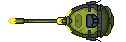

# OceanBattle 

###SOBRE
OceanBattle é um jogo 2D em Python desenvoldido com Pygame. 
O jogo tem duas fases, e cada fase termina com um evento de timeout.
Pode ser jogado cooperativo ou competitivo (2 jogadores).
Pontuação é salva em banco de dados SQLite3.

## MENU

## FASE 1

## FASE 2 - 2 JOGADORES

